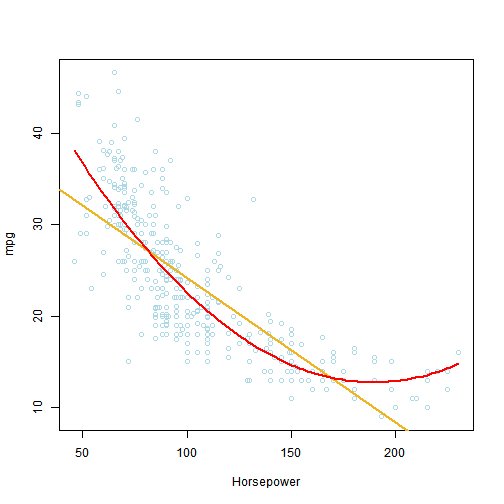
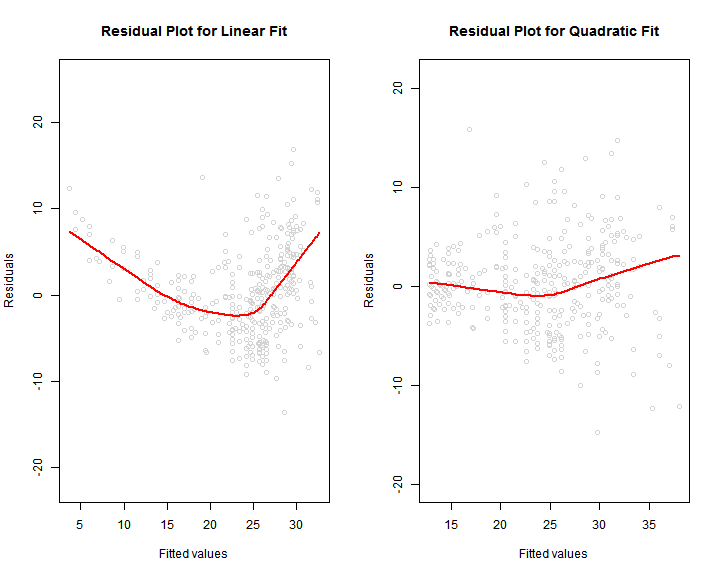
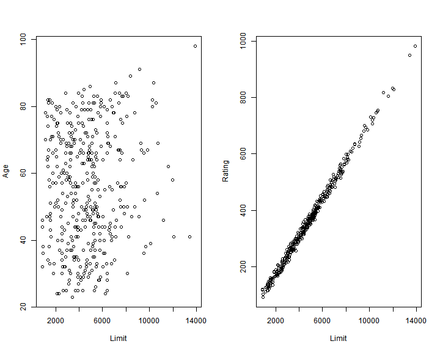

Considerations of the Regression Model
========================================================
author: Marcel Ramos
date: November 7, 2014
**An Introduction to Statistical Learning**  
_Gareth James • Daniela Witten • Trevor Hastie • Robert Tibshirani_

========================================================

Qualitative Predictors

- Dummy variable creation (SAS, SPSS)
- Automatically accounted for in R
- Usually coded as binary variables (0,1)
- The first category is taken as the reference category
- Use contrasts() function to verify categories - factors only


========================================================
 

Contrasts
========================================================

```r
contrasts(credit$Ethnicity)
```

```
                 Asian Caucasian
African American     0         0
Asian                1         0
Caucasian            0         1
```

```r
summary(lm(Balance~Ethnicity, data=credit))$coefficients
```

```
                    Estimate Std. Error    t value     Pr(>|t|)
(Intercept)        531.00000   46.31868 11.4640565 1.774117e-26
EthnicityAsian     -18.68627   65.02107 -0.2873880 7.739652e-01
EthnicityCaucasian -12.50251   56.68104 -0.2205766 8.255355e-01
```

Relevel
========================================================
- Reassign the reference category using the relevel() function

```r
contrasts(relevel(credit$Ethnicity, ref="Caucasian"))
```

```
                 African American Asian
Caucasian                       0     0
African American                1     0
Asian                           0     1
```

Extensions of the Linear Model
========================================================
- Relationship between X and Y is additive and linear
- The additive assumption states that changes in X on Y are independent of other Xs
- The linear assumption states that a one-unit change in X results in a constant change in Y (constant slope)

Removing the Additive Assumption
========================================================
- Example from the **Advertising** dataset
- Consider an non-independent effect of X1 and X2 on Y (e.g. Spending money on radio advertising increases the effectiveness of TV advertising).
- We can exend this model by adding an _interaction term_ to the regression equation. 
- Since radio advertising now depends on the TV advertising, the additive assumption is relaxed. 
- We can interpret the Beta coefficient of the interaction term as the effectiveness of TV advertising for a one unit increase in radio advertising or vice versa. 

Heirarchical Principle
========================================================
- Upon inclusion of an interaction in a model, main effects should also be included. 
- Confounding interactions should also be accounted for in multivariate models but only the _p_-values of the interactions of interest should be evaluated. 

Non-Linear Relationships
========================================================
- In some cases, the true relationship is non-linear. To accomodate for this, we can use a polynomial regression. 
- A simple approach is to add transformed versions of the predictors in the model. 
- For example, the shape of the relationship may be quadratic. 
- One would add a quadratic term to the linear relationship. 

========================================================
 
- Here the data does not conform to the linear assumption relationship. Therefore, the equation with a quadratic term:  
mpg = B0 + B1\*hp + B2\*hp^2 + e  
would provide a better fit (red line). 

Potential Problems
========================================================
1. Non-Linearity of the response-predictor relationships
2. Correlation of error terms
3. Non-constant variance of error terms
4. Outliers
5. High-leverage points
6. Collinearity

1. Non-linearity of the data
========================================================
- Residual plots can be used to identify non-linearity. 
 

2. Correlation of Error Terms
========================================================
- Error terms should be uncorrelated
- SE or the fitted values are based on uncorrelated error terms
- Correlated error terms underestimate the true standard errors and CI will be narrower than they should be
- This could cause the researcher to erroneously conclude that the _p_-value or CI is statistically significant
- Time series data: plot residuals against time variable and look for no discernible pattern

3. Non-constant Variance of Error Terms
========================================================
- Error terms should have a constant variance (_homoscedasticity_)
- Non-constant variance, _heteroscedasticity_, can be seen as a cone shape in residual plots
- Possible solutions include the transformation of the Y variable (e.g. log(Y))

4. Outliers
========================================================
- Outliers are fall far from the value predicted by the model
- Removal of outliers is most important for Root Squared Error (RSE) calculations as it is used to compute all CI and _p_-values. 
- They can influence the fit interpretation 
- Residual plots are useful for identifying outliers 
- Often difficult to decide how large a residual needs to be consider the removal of the outlier
- _Studentized residuals_ greater than the absolute value of 3 is a good measure of outlier identification

5. High Leverage Points
=========================================================
- High leverage observations have unusual values for X. 
- Removing high leverage points has a greater impact on the least squares regression line than removing an outlier. 
- More difficult to asses when multiple predictors are involved (multidimensional plotting). 
- _Leverage statistic_ can be computed. High leverage values relate to greater distance from the mean X value. 
- Outliers with high leverage are deemed highly influential points. 

6. Collinearity
=========================================================
- Occurs when 2 or more predictor variables are related. 
 

=========================================================
- The individual effects of each variable are not easily discernable 
- Collinearity reduces the accuracy of the estimates of the regression coefficients and allows inflated standard errors
- To avoid collinearity, look at a correlation matrix of the predictors
- Multicollinearity happens when three or more variables are related
- _Variance Inflation Factor_ (VIF) can be used to detect multicollinearity
- Ratio between variances of the fitted full-model coefficients and the stand-alone coefficient. 
- Rule of thumb: a VIF greater than 5 or 10 indicates problematic collinearity
- Options: drop problematic variables from the model or combine collinear variables (e.g. average)

The Marketing Plan
=========================================================
1. Reject the null hypothesis based on results of the F-statistic
2. Model accuracy can measured using RSE and R^2 statistic 
3. Determine what predictors contribute to the outcome using p-values
4. Narrow and far from zero confidence intervals indicate what predictors are related to the outcome
5. We can predict future outcomes via individual responses (prediction interval) or the average response (confidence interval)
6. Linear relationships can be determined using residual plots
7. Adding an interaction term can accommodate non-additive relationships.

Linear Regression versus K-Nearest Neighbors
=========================================================
- Linear Regression is a _parametric_ approach and makes a strong assumption about the form of f(X)
- _Non-parametric_ approaches do not make assumptions about the form of f(x) and are more flexible
- KNN regression identifies the K training observations that are closest to the test observation
- The optimal value for K depends on the _bias-variance_ tradeoff
- Small values of K are most flexible which will have low bias but high variance
- High values of K are smoother due to averaging of more points and less variable fit

Linear Regression versus K-Nearest Neighbors (2)
=========================================================
- Such smoothing may cause bias by "masking the structure of f(X)"
- Test error rates can be used to identify the optimal value of K
- The parametric approach will outperform the non-parametric approach when the former is close to the true f(X)
- In cases where the true form of f(X) is non-linear, KNN usually has lower MSE than linear regression although not always the case

Linear Regression versus K-Nearest Neighbors (3)
=========================================================
- At higher dimensions, more than 2 predictors, KNN may perform worse because of a reduction in sample size
- _Curse of dimensionality_ refers to the K observations that are nearest to the test observation may be very far away in dimensional space when the number of predictors is large and thus leading to a poor KNN fit.
- A linear model may often be preferred for the sake of interpretability although KNN may perform well at lower values of p but not by much
