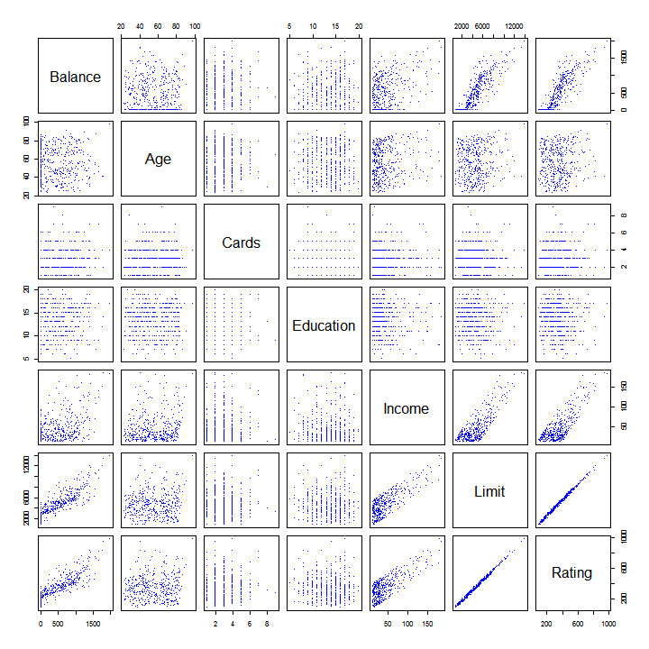

Qualitative Predictors
========================================================
author: Marcel Ramos
date: November 7, 2014

========================================================

Qualitative Predictors

- Dummy variable creation (SAS, SPSS)
- Automatically accounted for in R
- Usually coded as binary variables (0,1)
- The first category is taken as the reference category
- Use contrasts() function to verify categories - factors only


Pairs plots - Credit dataset
========================================================

 

Contrasts
========================================================


```r
contrasts(credit$Ethnicity)
```

```
                 Asian Caucasian
African American     0         0
Asian                1         0
Caucasian            0         1
```

```r
summary(lm(Balance~Ethnicity, data=credit))$coefficients
```

```
                    Estimate Std. Error    t value     Pr(>|t|)
(Intercept)        531.00000   46.31868 11.4640565 1.774117e-26
EthnicityAsian     -18.68627   65.02107 -0.2873880 7.739652e-01
EthnicityCaucasian -12.50251   56.68104 -0.2205766 8.255355e-01
```

Relevel
========================================================
- Reassign the reference category using the relevel() function

```r
contrasts(relevel(credit$Ethnicity, ref="Caucasian"))
```

```
                 African American Asian
Caucasian                       0     0
African American                1     0
Asian                           0     1
```

Extensions of the Linear Model
========================================================
- Relationship between X and Y is additive and linear
- The additive assumption states that changes in X on Y are independent of other Xs. 
- The linear assumption states that a one-unit change in X results in a constant change in Y. (constant slope)

Removing the Additive Assumption
========================================================
- In the analysis of the **Advertising** data, the authors concluded that both the radio budget and TV budget were independently associated with sales. 
- Consider an non-independent effect of X1 and X2 on Y (ie. Spending money on radio advertising increases the effectiveness of TV advertising).
- This is known as an _interaction effect_ or _effect measure modification_. 
- We can exend this model by adding an _interaction term_ to the regression equation. 
- Since radio advertising now depends on the TV advertising, the additive assumption is relaxed. 
- We can interpret the Beta coefficient of the interaction term as the effectiveness of TV advertising for a one unit increase in radio advertising or vice versa. 

Heirarchical Principle
========================================================
- Upon inclusion of an interaction in a model, main effects should also be included. 
- Confounding interactions should also be accounted for in multivariate models but only the _p_-values of the interactions of interest should be evaluated. 

Non-Linear Relationships
========================================================


